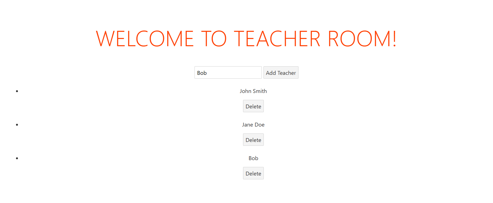

# Web Application

## Teacher Room App with Svelte

### Description

Aplikasi **Teacher Room** adalah aplikasi sederhana yang menggunakan **Svelte** untuk mengimplementasikan operasi Create, Read, dan Delete **(CRD)** pada daftar guru. Aplikasi ini memiliki fitur untuk menambahkan guru baru dan menghapus guru yang sudah ada.


Untuk menjalankan aplikasi ini kamu harus menginstall `nodejs` di komputer local masing-masing dengan mendownloadnya di <https://nodejs.org/en>. Setelah install kita bisa ikuti langkah-langkah berikut:

- Jalankan aplikasi ini dengan perintah `npm install` untuk menginstall package yang ada di file `package.json`
- Untuk running aplikasi di local komputer, lakukan perintah `npm run dev`
- Untuk membuat build to production, lakukan perintah `npm run build` hasilnya ada di folder `public/build`

Di sini kamu harus melengkapi fungsi pada file `src/service.js` agar aplikasi bisa berjalan dengan baik sesuai dengan spesifikasi.

### Test Case Examples

#### Test Case 1



**Input**:

Sebuah nama guru baru "Bob" dimasukkan ke dalam input.

**Expected Output / Behavior**:

Guru baru dengan nama "Bob" akan ditambahkan ke dalam daftar guru, dan nama "Bob" akan muncul di antara daftar guru. Sehingga data `teachers` akan bertambah sebagai berikut:

```js
let teachers = [
    { id: 1, name: "John Smith" },
    { id: 2, name: "Jane Doe" },
    { id: 3, name: "Bob" },
];
```

#### Test Case 2


**Input**:

Pada kasus uji ini, aplikasi diuji untuk memeriksa apakah guru yang dipilih dapat dihapus dari daftar guru dan apakah daftar guru memperbarui daftar dengan benar setelah penghapusan. Setelah guru pertama dihapus, aplikasi diuji lagi untuk memeriksa apakah guru kedua masih muncul di daftar guru dan apakah teks "No teachers found" muncul ketika daftar kosong.

**Expected Output / Behavior**:

Guru pertama di daftar (John Smith) akan dihapus dari daftar guru, dan teks "John Smith" tidak muncul lagi di daftar guru. Guru kedua (Jane Doe) dan ketiga (Bob) masih ada di daftar. Sehingga data `teachers` akan berubah sebagai berikut:

```js
let teachers = [
    { id: 2, name: "Jane Doe" },
    { id: 3, name: "Bob" },
];
```

### Deploy to Netlify

Untuk melakukan deploy aplikasi ke Netlify, silakan ikuti langkah-langkah berikut:

1. Buat repositori baru di GitHub dan unggah kode aplikasi ke dalamnya.
2. Buka <https://app.netlify.com/> dan buat akun jika belum memiliki akun.
3. Klik tombol "New site from Git" dan pilih repositori yang sudah dibuat.
4. Pilih opsi "Svelte" sebagai jenis proyek.
5. Pilih opsi "Build command" dengan nilai `npm run build`.
6. Pilih opsi "Publish directory" dengan nilai `public`.
7. Klik tombol "Deploy site" untuk memulai proses deploy.
8. Tunggu hingga proses deploy selesai dan buka aplikasi dengan alamat yang ditentukan oleh Netlify.

Share hasil deploy mu ke **Instruktur** untuk di periksa.
